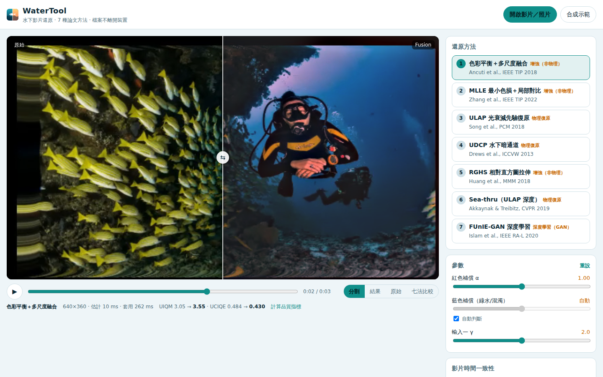
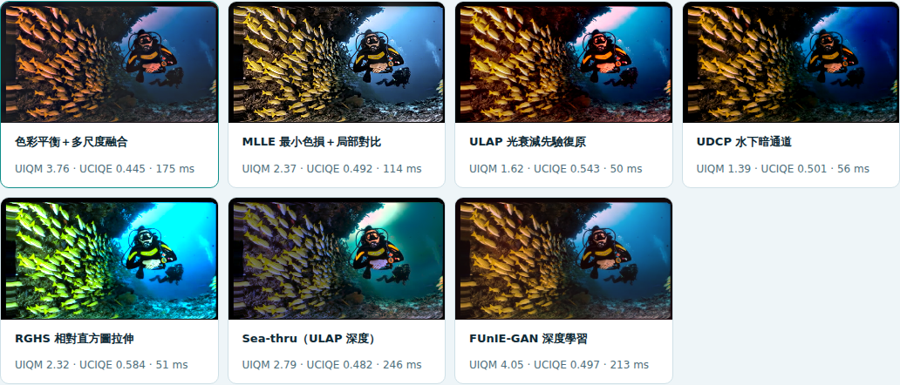

# 🌊 WaterTool — 水下影片還原工作台

把網路上**有論文、有 GitHub 原始碼**的水下影像還原方法整理出 7 種，重新實作成一個**純瀏覽器**的 App：
開啟水下影片或照片 → 選方法 → 分割畫面即時比較 → 匯出 MP4 / PNG。
影片另外加了**時間一致性**（防閃爍），因為逐幀方法直接套在影片上最常見的問題就是閃爍。

- **不上傳、不需伺服器**：所有運算在本機瀏覽器的背景執行緒完成。
- **可安裝成 App**（PWA）：手機「加到主畫面」、桌面 Chrome「安裝」，安裝後可離線使用。
- **7 種方法**：6 種傳統（物理模型 / 增強）+ 1 種深度學習（FUnIE-GAN，ONNX 在瀏覽器執行）。
- **每種方法都有客觀評測**：合成真值場景、EUVP 真實照片、合成影片的閃爍量測（[`docs/results.md`](docs/results.md)）。





## 快速開始

```bash
npm install          # 只有開發 / 測試需要；網站本身是純靜態檔
npm run serve        # http://localhost:8080
npm test             # 18 個單元測試（核心運算、7 種方法、時間穩定化）
npm run e2e -- <影片>  # 無頭 Chromium 端對端：播放、七法比較、FUnIE-GAN、匯出 MP4/PNG
node scripts/bench.mjs [EUVP data/test 目錄] > docs/results.md   # 重新評測
```

**發佈成網站**：推到 `main` 後由 `.github/workflows/pages.yml` 部署到 GitHub Pages
（第一次需在 *Settings → Pages → Source* 選 **GitHub Actions**），網址會是
`https://jonwenjen.github.io/WaterTool/`。

**安裝成 App**：用手機開上面網址 → Android Chrome「加到主畫面 / 安裝應用程式」、iOS Safari「分享 → 加入主畫面」；
桌面 Chrome / Edge 網址列右側的「安裝」按鈕（App 內也有「安裝 App」按鈕）。

## 使用方式

1. **開啟影片／照片**（或拖進畫面）。沒有素材可按 **合成示範**，會產生一段已知真值的合成水下影片。
2. 右側選 **還原方法**，調整參數；畫面上拖曳分割線比較原始 / 還原。
3. **七法比較** 會把目前畫面用 7 種方法各算一次，並列顯示（含 UIQM / UCIQE 與耗時），點一下即切換。
4. **影片時間一致性**：τ（參數平滑時間）、輸出去閃爍強度、每 N 幀重新估計（FUnIE-GAN 預設 4）。
5. **匯出**：照片 → PNG；影片 → MP4（WebCodecs 編碼，H.264 不可用時自動改 VP9/AV1，**保留原音軌**）。

---

## 一、研究整理：網路上的論文與 GitHub 實作

### 實作進 App 的 7 種方法

| # | 方法 | 類型 | 論文 | GitHub 參考實作 |
|---|---|---|---|---|
| 1 | 色彩平衡 + 多尺度融合 | 增強 | Ancuti et al., *Color Balance and Fusion for Underwater Image Enhancement*, IEEE TIP 2018 · [DOI](https://doi.org/10.1109/TIP.2017.2759252) | [fergaletto/…（MATLAB）](https://github.com/fergaletto/Color-Balance-and-fusion-for-underwater-image-enhancement.-.)、[fowles/underwater-color](https://github.com/fowles/underwater-color)、[arm-on/underwater-image-enhancement](https://github.com/arm-on/underwater-image-enhancement) |
| 2 | MLLE 最小色損 + 局部自適應對比 | 增強 | Zhang et al., *Underwater Image Enhancement via Minimal Color Loss and Locally Adaptive Contrast Enhancement*, IEEE TIP 2022 · [DOI](https://doi.org/10.1109/TIP.2022.3177129) | [Li-Chongyi/MMLE_code（官方）](https://github.com/Li-Chongyi/MMLE_code)、[nomi30701/…（Python 重現）](https://github.com/nomi30701/Underwater-image-color-correction-adaptive-contrast-enhancemention-and-yolo-detect-python) |
| 3 | ULAP 水下光衰減先驗 | 物理復原 | Song et al., *A Rapid Scene Depth Estimation Model Based on Underwater Light Attenuation Prior*, PCM 2018 · [連結](https://researchportal.scu.edu.au/esploro/outputs/bookChapter/A-Rapid-Scene-Depth-Estimation-Model/991012926976402368) | [wangyanckxx/Single-Underwater-Image-Enhancement-and-Color-Restoration](https://github.com/wangyanckxx/Single-Underwater-Image-Enhancement-and-Color-Restoration) |
| 4 | UDCP 水下暗通道先驗 | 物理復原 | Drews et al., *Transmission Estimation in Underwater Single Images*, ICCV Workshops 2013 · [CVF](https://openaccess.thecvf.com/content_iccv_workshops_2013/W24/html/Drews_Jr._Transmission_Estimation_in_2013_ICCV_paper.html) | 同上（UDCP 資料夾） |
| 5 | RGHS 相對全域直方圖拉伸 | 增強 | Huang et al., *Shallow-water Image Enhancement Using Relative Global Histogram Stretching*, MMM 2018 · [HAL](https://hal-amu.archives-ouvertes.fr/hal-01632263) | 同上（RGHS 資料夾） |
| 6 | Sea-thru（修正成像模型） | 物理復原 | Akkaynak & Treibitz, *Sea-thru: A Method for Removing Water From Underwater Images*, CVPR 2019 · [CVF](https://openaccess.thecvf.com/content_CVPR_2019/html/Akkaynak_Sea-Thru_A_Method_for_Removing_Water_From_Underwater_Images_CVPR_2019_paper.html) | [hainh/sea-thru](https://github.com/hainh/sea-thru)、[CV-Reimplementation/Sea-thru-implementation](https://github.com/CV-Reimplementation/Sea-thru-implementation) |
| 7 | FUnIE-GAN | 深度學習 | Islam, Xia, Sattar, *Fast Underwater Image Enhancement for Improved Visual Perception*, IEEE RA-L 2020 · [arXiv](https://arxiv.org/abs/1903.09766) | [xahidbuffon/FUnIE-GAN（官方，MIT）](https://github.com/xahidbuffon/FUnIE-GAN) |

### 影片專用（時間一致性）的研究

| 論文 | 重點 | 程式 |
|---|---|---|
| Srinath et al., *UnDIVE: Generalized Underwater Video Enhancement Using Generative Priors*, WACV 2025 · [arXiv 2411.05886](https://arxiv.org/abs/2411.05886) | 物理成像式做空間增強 + 幀間一致性損失 | [suhas-srinath/undive](https://github.com/suhas-srinath/undive) |
| Xie et al., *UVEB: A Large-scale Benchmark and Baseline Towards Real-World Underwater Video Enhancement*, CVPR 2024 · [arXiv 2404.14542](https://arxiv.org/abs/2404.14542) | 1,308 對影片的資料集；UVE-Net 把當前幀轉成卷積核傳給相鄰幀 | [yzbouc/UVEB](https://github.com/yzbouc/UVEB) |
| *Enhancing Underwater Video from Consecutive Frames While Preserving Temporal Consistency*, JMSE 2025 · [DOI](https://doi.org/10.3390/jmse13010127) | 雙分支網路，以光流維持時間一致 | — |
| *WaterWave: … Wavelet-based Temporal Consistency Field*, [arXiv 2512.05492](https://arxiv.org/pdf/2512.05492) | 把單張增強器接上小波域的時間一致性場 | — |
| Bonneel et al., *Blind Video Temporal Consistency*, SIGGRAPH Asia 2015 · [專案頁](https://perso.liris.cnrs.fr/nicolas.bonneel/consistency/) | 任何逐幀處理都能事後去閃爍：梯度取自當前處理幀、其餘對齊前一幀 | 專案頁有程式 |
| Lai et al., *Learning Blind Video Temporal Consistency*, ECCV 2018 · [arXiv 1808.00449](https://arxiv.org/abs/1808.00449) | 遞迴網路學習去閃爍；提出扭曲誤差 E_warp 指標 | — |
| Lei et al., *Blind Video Temporal Consistency via Deep Video Prior*, NeurIPS 2020 | 以影片本身訓練的網路做一致性 | [ChenyangLEI/deep-video-prior](https://github.com/ChenyangLEI/deep-video-prior) |

### 彙整清單與資料集

- [fansuregrin/Awesome-UIE](https://github.com/fansuregrin/Awesome-UIE)、[CXH-Research/Underwater-Image-Enhancement](https://github.com/CXH-Research/Underwater-Image-Enhancement)：水下影像增強論文/程式清單。
- [ddz16/UIE_Benckmark](https://github.com/ddz16/UIE_Benckmark)：多種方法（含 MLLE）的統一實作。
- 資料集：EUVP（FUnIE-GAN 倉庫）、UIEB（Li et al., TIP 2019）、UVEB（影片）。
- 綜述：Wang et al., *An Experimental-based Review of Image Enhancement and Image Restoration Methods for Underwater Imaging*（[arXiv 1907.03246](https://arxiv.org/abs/1907.03246)，即上面 wangyanckxx 倉庫）。

**為什麼影片專用的深度模型（UnDIVE、UVE-Net）沒有直接放進 App**：它們需要 PyTorch + GPU 推論（數十 MB 以上權重、每幀數百 ms 到數秒），
在手機瀏覽器裡跑不動，也違背「檔案不離開裝置」。App 採用它們的核心觀察——逐幀方法的閃爍主要來自**每幀獨立估計的全域參數**
與**低頻亮度/色彩的跳動**——用可即時執行的方式處理（見第三節）。

---

## 二、7 種方法：原理與本實作

每個方法分成兩步：`estimate()` 在 320 px 小圖上估計**全域量**（背景光、白平衡增益、拉伸範圍、散射係數…），
`apply()` 在處理解析度上套用。這樣一來估計便宜、全域量也能做時間平滑。程式在 [`lib/methods/`](lib/methods)。

### 1. 色彩平衡 + 多尺度融合（Ancuti 2018）— [`ancuti.js`](lib/methods/ancuti.js)
紅色通道補償 `R += α(Ḡ − R̄)(1 − R)G`（綠水時自動同時補償藍色）→ 灰色世界白平衡 →
兩個輸入：Gamma（γ=2）版與「正規化反銳化遮罩」版 → 權重 = 拉普拉斯對比 + 顯著性（Achanta）+ 飽和度，
正規化 `(W+δ)/(ΣW+Kδ)` → 拉普拉斯 / 高斯金字塔融合。
**適用**：幾乎所有水色；評測中合成場景平均色差最低。**缺點**：最慢（金字塔），開放水域偏灰。

### 2. MLLE（Zhang 2022）— [`mlle.js`](lib/methods/mlle.js)
LACC：以平均最大的通道為參考，`medium += K·L`，補償量依「最大衰減圖」`1 − I_small^1.2` 混合並加回細節層。
參考碼以迭代求 K，本實作用其**收斂值的封閉解** `K = (L̄ − mean)/L̄`（結果相同、每幀時間固定）。
LACE：L 通道 `μ + min(σ²_global/σ²_local, β)(L − μ)`，局部統計用 O(n) 方框濾波**逐像素**計算（參考碼是 25 px 區塊、會有接縫），
再引導濾波，最後平衡 Lab 的 a/b。**適用**：綠/藍色偏重的近景。**缺點**：開放水域偏紫。

### 3. ULAP（Song 2018）— [`ulap.js`](lib/methods/ulap.js)
深度 `d = 0.5116 + 0.5052·max(G,B) − 0.9051·R`（參考碼係數）→ 引導濾波細化 → 背景光取最遠 0.1% 中最亮者 →
`d_f = 8(d + d0)`、`t = {0.83, 0.95, 0.97}^d_f` → `J = (I − B)/t + B`。**最快**之一，結果保守。

### 4. UDCP（Drews 2013）— [`udcp.js`](lib/methods/udcp.js)
G、B 兩通道的暗通道 → 背景光 → 透射率 `1 − ω·min_patch(min(G/A_G, B/A_B))`、限制 [0.1, 0.9]、引導濾波 → 反解。
原方法不處理色偏且偏暗，所以加了**可調的後置白平衡**（預設開；設 0 即原方法）。去霧最強，但容易過飽和。

### 5. RGHS（Huang 2018）— [`rghs.js`](lib/methods/rghs.js)
G/B 等化（`0.5/mean`）→ 每通道相對拉伸 `[I_min, I_max] → [I_min, 1]`（保留暗端，不硬拉紅）→
Lab：L 1%/99% 拉伸、a/b 以 `x·1.3^(1−|x|/128)` 提高彩度。**適用**：淺水、色偏不重的畫面，色彩自然。

### 6. Sea-thru（Akkaynak & Treibitz 2019）— [`seathru.js`](lib/methods/seathru.js)
在**線性光**上：深度分 10 段、每段取最暗 1%（最多 20 點）擬合 `B(z) = B∞(1−e^{−β_B z}) + J′e^{−β_D′ z}`（網格搜尋 + 有界最小平方）→
扣散射 → 以深度為引導的大半徑濾波近似 LSAC 估光源 `E = 2a` → `β_D = −ln(E)/z` 依深度分段取中位數 → `J = D·e^{β_D(z) z}` →
G/B 最亮 10% 白平衡（紅取兩者平均，同參考碼）→ 拉伸。
**與原論文的差異（重要）**：原論文需要 RGB-D 或 SfM 深度；影片沒有，這裡用 ULAP 的單張深度先驗（相對深度，對應到 [近, 遠] 公尺）。
因為深度不是真實距離，加了三個防護：只扣真正的散射項（`J′` 項是暗點本身殘留的直射光）、散射不超過該深度最暗像素、
增益上限（亮度 ≤ 4×、通道比 ≤ 5×）；最遠的開放水域（原論文中沒有深度的像素）保留原色。

### 7. FUnIE-GAN（Islam 2020）— [`funie.js`](lib/methods/funie.js)
官方 PyTorch 權重轉 ONNX（float16，14 MB），以 onnxruntime-web（WASM）在背景執行緒推論。
網路只在長邊 256 px 的小圖上跑；它的效果擬合成**逐通道局部仿射轉換**（引導濾波係數 a、b），放大後套到原解析度——
顏色來自網路，細節保留原片；係數本身也能做時間平滑。第一次使用下載約 28 MB（模型 + WASM），之後由瀏覽器快取。

---

## 三、影片時間一致性 — [`lib/temporal.js`](lib/temporal.js)

1. **參數層**：每幀估出的全域量做指數移動平均（時間常數 τ 秒，以實際幀間隔計算 `α = 1 − e^{−dt/τ}`）；
   以 8×8 色度 + 8 階亮度直方圖距離偵測**換鏡頭**，換鏡頭時立即重設（不會拖泥帶水）。
   不可內插的量（例如 MLLE 的通道排序）一改變就整體重設。
2. **輸出層（盲去閃爍，免光流）**：輸入與輸出都縮成長邊 48 的粗網格；輸入幾乎沒變的格子（靜止區域）讓輸出低頻跟隨前一幀穩定值，
   移動的格子直接放行；修正量雙線性放大後加回——只動低頻，不糊細節。是 Bonneel 2015「梯度取自當前幀、低頻對齊前一輸出」的簡化版。
3. **每 N 幀重新估計**：其餘幀沿用（並平滑）上次的全域量，對 FUnIE-GAN 這類慢的估計特別有用。

---

## 四、評測結果（摘要，完整見 [`docs/results.md`](docs/results.md)）

**合成場景**（已知真值；水上場景經修正成像模型退化成藍水/綠水/混濁）——平均色差 ΔE（越低越好）：

| 方法 | 平均 ΔE | 每幀（640×360，Node 單執行緒） |
|---|---|---|
| 未處理 | 35.5 | — |
| **色彩平衡＋融合** | **21.1** | 303 ms |
| MLLE | 21.8 | 200 ms |
| FUnIE-GAN | 26.0 | 261 ms |
| Sea-thru（ULAP 深度） | 29.3 | 254 ms |
| RGHS | 33.7 | 81 ms |
| ULAP | 35.6 | 65 ms |
| UDCP | 49.7 | 56 ms |

**EUVP 真實照片**（23 張）：UIQM 未處理 2.73 → 融合 **3.46**、FUnIE-GAN 3.23、Sea-thru 3.10、MLLE 3.07；
與資料集參考圖的色差 FUnIE-GAN 最低（13.3，它就是在這個資料集上訓練的）。

**影片閃爍**（合成平移影片，亮度閃爍 0–255）：時間穩定化讓 7 種方法中的 6 種閃爍降低 **51–90%**
（例：UDCP 2.46 → 0.63、FUnIE-GAN 1.46 → 0.14），扭曲誤差也全部下降。
例外是 RGHS（1.32 → 1.39）：它每幀的直方圖拉伸本來就會抵消輸入的曝光抖動，平滑參數反而保留了輸入本身的抖動。

**怎麼選**：一般水下影片先用 **1 融合**（最穩）；綠水/色偏重的近景試 **2 MLLE** 或 **7 FUnIE-GAN**；
想保留水的氛圍、淺水晴天用 **5 RGHS**；有霧感、想強去霧試 **4 UDCP**（白平衡開）；**6 Sea-thru** 對有遠近層次的場景最「物理」，但依賴深度先驗。

> 指標的限制：UIQM / UCIQE 會獎勵高對比、高飽和（UDCP 的 UCIQE 最高但色差最大），只能當參考；
> 合成場景的色差是「真值」意義下的比較，但退化模型是簡化的；EUVP 的參考圖是人工挑選的增強結果，不是真值。

---

## 五、檔案結構

```
index.html  style.css  app.js     介面（分割比較、播放、七法比較、匯出）
worker.js                         背景執行緒：所有運算、FUnIE-GAN 載入
sw.js  manifest.webmanifest       PWA（離線、安裝）
lib/core.js                       影像基礎：縮放、方框/高斯/最小值濾波、引導濾波、金字塔、Lab
lib/methods/*.js                  7 種方法（estimate / apply）
lib/temporal.js                   時間一致性
lib/pipeline.js                   單幀管線：估計 → 平滑 → 套用 → 去閃爍 → 強度
lib/metrics.js                    UIQM、UCIQE、色差
lib/synth.js                      合成真值場景與影片（測試與「合成示範」）
models/  vendor/                  FUnIE-GAN ONNX、onnxruntime-web、mediabunny（npm run vendor 更新）
test/  scripts/                   單元測試、評測、端對端、靜態伺服器
```

## 授權

程式碼 MIT（[`LICENSE`](LICENSE)）。第三方：FUnIE-GAN 權重 MIT（[`models/FUnIE-GAN-LICENSE`](models/FUnIE-GAN-LICENSE)）、
onnxruntime-web MIT、Mediabunny MPL-2.0（[`vendor/`](vendor)）。各方法的演算法版權屬原論文作者；本專案依論文與公開參考碼重新實作。
評測用的 EUVP 照片不隨專案發佈（由 `bench.mjs` 從 FUnIE-GAN 倉庫另行取得）。
